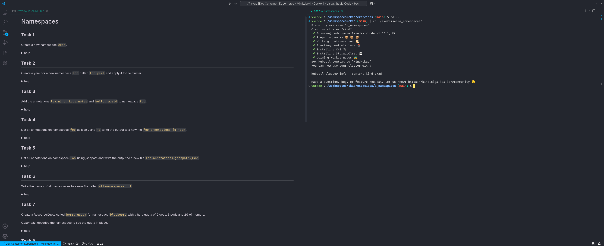

# CKAD Exam Preparation

The repository provides exercises to prepare you for Kubernetes Exams like the Certified Kubernetes Application Developer (CKAD).

The exercises are all __"hands-on"__ and there is no further guidance in terms of _understanding kubernetes itself_.
Take a look at the [More Resources Section](#more-resources) below for further learning materials and courses.

__Good Luck!__

If you like the exercises and would like to support my work please use:

## Prerequisites

If you want to use the exercises in the "intended way" you need to install:

- A Container runtime like [Docker](https://docs.docker.com/engine/install/)
- [Visual Studio Code](https://code.visualstudio.com/)

## Using the exercises

After installing a container runtime and VS Code, clone the repository and open the directory with VS Code.

VS Code will then start the environment for the exercises - if you're asked select to __Open Project in DevContainer__.
It might take while for VS Code to spin up the environment the first time, so please be patient.

When VS Code is ready the workflow to use the exercises is always the same:

- Navigate to the exercise directory in a terminal window (i. e. `cd ./exercises/a_namespaces`)
  - This might take a moment because a new cluster is created for every exercise.
- Open up the exercise _README.md_ file as __preview__ (right click -> `Open Preview`)
- Use the `verify.sh` script in the exercise folder to check your success
  - Call it either with `./verify.sh` or `./verify.sh <tasknumber>` in your terminal
  - If you're stuck but can't figure out why use `export CKAD_EXAM_DEBUG=true` to get more details
- If you're done leave the directory on the command line `cd ..` to reset the exercises and navigate to the next directory.

__Have Fun!__

__Note:__
Using drag and drop you can split your view between a terminal window and the exercise README.

## Under the hood

Everything you run for the exercises is executed locally, but does not affect your local environment.
This works with a combination of different tools:

- DevContainers to spin up a container that won't touch your local system and has everything needed to solve the exercises already installed.
- Docker in Docker (dind) to use Kubernetes inside that container.
- Autoenv to prepare and cleanup the exercises (start a cluster, remove files etc.)
- VS Code for ease of use as well as extensions for developing new exercises.

__Note:__
VS Code is not strictly necessary to use the DevContainer environment.
You can also use the DevContainer CLI, other IDEs or Editors that support DevContainers and so on.

## Known Issues

### Fedora Linux

- The container might not be able to access the docker-daemon (see: [github issue](https://github.com/devcontainers/features/issues/1235))
  - solution: enable the ip_tables kernel module: `sudo modprobe ip_tables`

### Known Limitations

I created these exercises before I took the Exam and while they're pretty accurate there're little things that can be improved.
For example I use `jq` a lot for parsing json output, but the exam uses yaml output with `yq`.
The syntax is the near enough, however - so instead of `k get po my-pod -o json | jq .spec` you need to go with `k get po my-pod -o yaml | yq .spec`.

I'll update these things as soon as I find some time.

## More Resources

I strongly recommend to go through the following resources as well:

### Course

I took the [Kubernetes Certified Application Developer (CKAD) with Tests](https://www.udemy.com/course/certified-kubernetes-application-developer/).

Create a Udemy Account in advance and log in before looking up the course.
That way it's often on sale and very much affordable.
Furthermore it comes with a 30% discount code for the real exam and is always up to date.

There is also a course for the [Certified Kubernetes Administrator (CKA) with Practice Tests](https://www.udemy.com/course/certified-kubernetes-administrator-with-practice-tests/).

### Training resources

- <https://kubernetes-tutorial.schoolofdevops.com/>
- <https://github.com/dgkanatsios/CKAD-exercises>
- <https://github.com/bmuschko/ckad-crash-course>

### Creating more exercises

If you still feel unprepared a good way to create more exercises is using AI.
See the [AI Templates](./AI-TEMPLATES.md). Make sure to double check the results to be valid, however.

## Strategy for the Exams

- Make sure you have a good understanding the relations and workings of the `kubernetes resources`.
- Prepare thorough until you feel comfortable especially with `kubectl` and all its subcommands.
- You'll get two __preparation exams__.
  - I'd take the first one a week before the exam to get a feel for it and have some time left to fill in missing blanks.
  - Take the second a day or two before the real exam to get used to the test environment before the final challenge.
